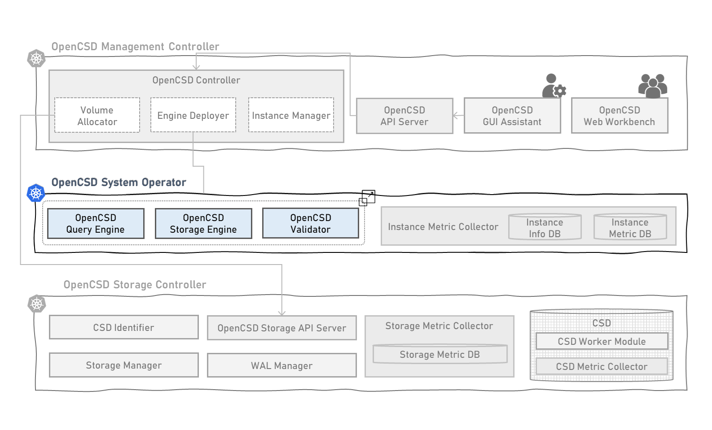

# Introduction of Deployment for OpenCSD Instance
-------------

This is yaml files and scripts for opencsd instance deployment.

Developed by KETI



## Contents
-------------
[1. Requirement](#requirement)

[2. Node Requirement](#operation-node-requirement)

[3. How To Install](#how-to-install)

[4. How To Debug](#how-to-debug)

[5. Governance](#governance)


## Requirement
>   Kubernetes 1.26 <br>
>   Containerd 1.6.21 <br>

## Operation Node Requirement
```bash
kubectl label nodes operator-node key=worker
kubectl label nodes operator-node layer=operator
kubectl label node operator-node node-role.kubernetes.io/worker=
```

## How To Install
before deploy the pod, build image first
- *[KETI-Query-Engine-Instance](https://github.com/opencsd/KETI-Query-Engine-Instance)*
- *[KETI-Storage-Engine-Instance](https://github.com/opencsd/KETI-Storage-Engine-Instance)*
- *[KETI-Validator](https://github.com/opencsd/KETI-Validator)*
<br><br>

```bash
git clone
cd System-Operator
./1.query-engine-instance.sh
./2.storage-engine-instance.sh
./3.validator.sh
```
```bash
kubectl get pods -n keti-opencsd
```
```bash
NAMESPACE               NAME                                        READY   STATUS    RESTARTS         
keti-opencsd            query-engine-instance-765fb64f98-zbzvd      1/1     Running   0                
keti-opencsd            storage-engine-instance-66f4fd497d-72tfh    4/4     Running   0                
keti-opencsd            validator-779844f95c-7n6lz                  1/1     Running   0                
```

## How To Debug
```bash
./0.debug.sh q # query engine
./0.debug.sh i # storage engine - interface
./0.debug.sh o # storage engine - offlaoding module 
./0.debug.sh m # storage engine - merging module 
```


## Governance
This work was supported by Institute of Information & communications Technology Planning & Evaluation (IITP) grant funded by the Korea government(MSIT) (No.2021-0-00862, Development of DBMS storage engine technology to minimize massive data movement)